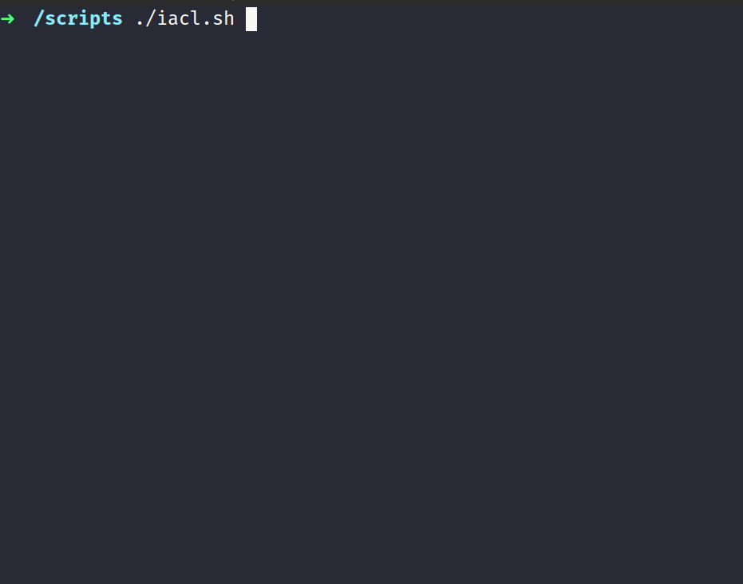

# Script Infra como código

> Status do projeto: concluído!

Para rodar esse projeto na sua máquina, por favor digite:
```
./iacl.sh 
```

<p align="center">

</p>

## Descrição
Segue abaixo as seguintes definições que contem no script:

- O dono de todos os diretórios criados será o usuário root.
- Todos os usuários terão permissão total dento do diretório público.
- Os usuários não poderão ter permissão de leitura, escrita e execução em diretórios de departamentos que eles não pertencem.
- Diretórios: /publico, /adm, /ven, /sec
- Grupos: GRP_ADM, GRP_VEN, GRP_SEC
- Usuários: 
(carlos, maria, joao,) / (debora, sebastiana roberto) / (josefina, amanda, rogerio)  
